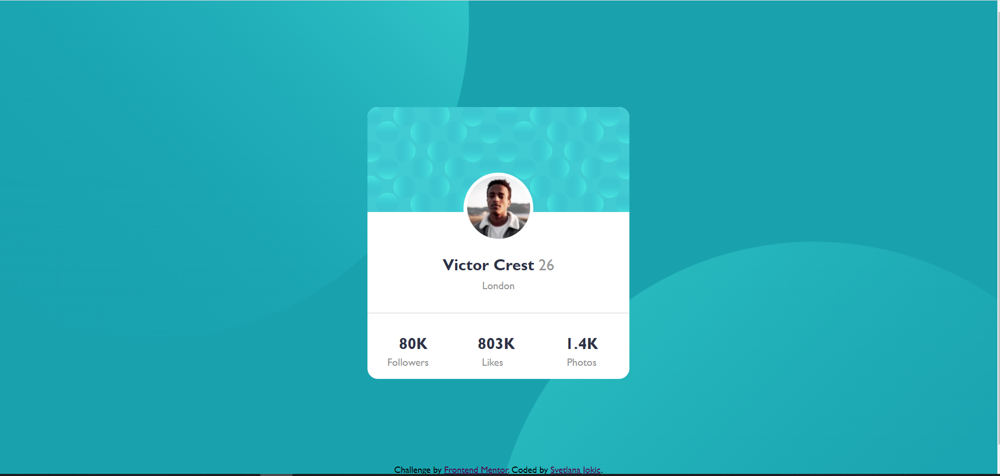

# Frontend Mentor - Profile card component solution

This is a solution to the [Profile card component challenge on Frontend Mentor](https://www.frontendmentor.io/challenges/profile-card-component-cfArpWshJ). Frontend Mentor challenges help you improve your coding skills by building realistic projects.

## Table of contents

- [Overview](#overview)
  - [Screenshot](#screenshot)
  - [Links](#links)
- [My process](#my-process)
  - [Built with](#built-with)
  - [What I learned](#what-i-learned)
  - [Continued development](#continued-development)
  - [Useful resources](#useful-resources)
- [Author](#author)
- [Acknowledgments](#acknowledgments)

## Overview

Built Profile card with CSS and HTML. Body is centered. This project is so good to practice postioning of content on your page, and to improve more responsive design.

### Screenshot




### Links

- Solution URL: [https://github.com/Holllyyyy/profile-card](https://github.com/Holllyyyy/profile-card)
- Live Site URL: [https://profile-card-component-holy.netlify.app/](https://profile-card-component-holy.netlify.app/)

## My process

I started with writing basic HTML where I just added couple of divs. After it I moved on my style. I make css folder, and wrote basic css.
I started with this:

```css
@import url("https://fonts.google.com/specimen/Kumbh+Sans:wght@400;700&display=swap"); /*here is just google font Kumbh*/

:root {
  --Dark-cyan: hsl(185, 75%, 39%);
  --Very-dark-desaturated-blue: hsl(229, 23%, 23%);
  --Dark-grayish-blue: hsl(227, 10%, 46%);
  --Dark-gray: hsl(0, 0%, 59%);
} /* just some colors what i used in this projects*/

* {
  padding: 0;
  margin: 0;
  box-sizing: border-box;
  font-family: "Kumbh", "Gill Sans", "Gill Sans MT", Calibri, "Trebuchet MS",
    sans-serif;
} /*some basics with '*' what will be applied at all elements */

body {
  min-height: 100vh;
  max-width: 100%;
  background-color: var(--Dark-cyan);
  background-image: url("../images/bg-pattern-top.svg"),
    url("../images/bg-pattern-bottom.svg");
  background-position: right calc(47vw + 15%) bottom calc(65vh - 15vw), left
      calc(40vw + 25%) top calc(72vh - 10vw);
  background-repeat: no-repeat, no-repeat;
  display: flex;
  align-items: center;
  justify-content: center;
  flex-direction: column;
  padding: 1rem;
  margin: 1rem;
} /* here I put min height n max with of 100 , added some background color and image  with some calculation how exactly i wanna my pictures to be locate %,vw,vh are relative lenghts , and more easier to use them 
for better responsive webpage, than to use px who are absolute  lenghts, background to no-repeat , because i want to avoid repeating. display flex , because ots much easier for me, to 
center element with some padding and margin to make it all looks*/
.container {
  max-width: 100vw;
  width: 100%;
  min-height: 100vh;
  margin-top: auto;
  margin-bottom: auto;
  display: flex;
  justify-content: center;
  align-items: center;
  flex-direction: column;
} /* at frist i put how it would look for mobile view, than later for larger screen,i centered with flex */

.wrapper {
  border-top: var(--Dark-cyan);
  border-right: var(--Dark-cyan);
  border-left: var(--Dark-cyan);
  display: flex;
  align-items: center;
  justify-content: center;
  flex-direction: column;
  width: 90%;
  max-width: 90vw;
  border-radius: 1rem;
  -webkit-border-radius: 1rem;
  -moz-border-radius: 1rem;
  -o-border-radius: 1rem;
  background: #ffffff;
} /*here also is at first how it should look for mobile, centered with flex, n some border with browser prefixes */
.upbackpic {
  background-image: url("../images/bg-pattern-card.svg");
  background-repeat: no-repeat;
  background-size: cover;
  width: 100%;
  max-width: 80vw;
  display: block;
  border-radius: 1rem 1rem 0 0;
  -webkit-border-radius: 1rem 1rem 0 0;
  -moz-border-radius: 1rem 1rem 0 0;
  -o-border-radius: 1rem 1rem 0 0;
} /*upbackpic is child of wrapper so thats why width is like it, cause taking that space from it inside not actualy size, i put display block for picture cause its the only picture here*/
.wrapper > .upbackpic {
  width: 100%;
  padding: 0 40% 40% 40%;
}
.circlepic {
  width: 100%;
  max-width: 100vw;
  border-radius: 50%;
  -moz-border-radius: 50%;
  -o-border-radius: 50%;
  -webkit-border-radius: 50%;
  background-color: #ffffff;
} /* this part here was challenge for me cause i ve never done something like this. border radius of 50% giving circle, */
.circle {
  border: 5px solid #ffffff;
  border-radius: 50%;
  -moz-border-radius: 50%;
  -o-border-radius: 50%;
  -webkit-border-radius: 50%;
  margin-top: -60px;
  max-width: 100%;
  background-color: #ffffff;
} /* why I put background color white( #ffffff) ?  Because I ran into problem on the moment 
when I put picture inside it*/

.wrapper > .circle {
  background-color: #ffffff;
}

.wrapper > .name {
  display: flex;
  justify-content: space-evenly;
  width: 100%;
  padding: 1rem 1rem 0 1rem;
  margin: 0 1rem 0rem 1rem;
} /* just for name some space between them */
.wrapper > .city {
  display: flex;
  justify-content: center;
  align-items: center;
  padding-bottom: 2rem;
  text-align: center;
  padding-top: 8px;
  margin: auto;
  font-weight: 400;
  color: var(--Dark-gray);
} /*this is for city to be centered*/

.wrapper > .numbers {
  border-top: 1px solid rgb(211, 209, 209);
  padding-top: 2rem;
  padding-bottom: 5px;
  display: flex;
  justify-content: space-around;
  align-items: center;
  margin: auto;
  width: 100%;
} /* numbers -- here i put one line on top with border top */
.numbers > h2 {
  margin-left: 5%;
}
.numbers > h2:last-child {
  margin-right: 5%;
} /* I used this cause I wanted just last to move a little bit, because in my html i created div for just numbers and later next div for .sections(followers,likes,photos)*/

.wrapper > .sections {
  display: flex;
  justify-content: space-around;
  align-items: center;
  margin: auto;
  width: 100%;
  margin-bottom: 1rem;
  font-weight: 400;
  color: var(--Dark-gray);
} /*here is that what i meantioned earlier with font-weight which is less than usual font,*/
.sections > .foll {
  margin-right: 5%;
}
.sections > .foll:nth-child(2) {
  margin-right: 9%;
} /*just moved again one with :nth-child()*/

.numbers {
  font-size: 1, 125rem;
  font-weight: 700;
  color: var(--Very-dark-desaturated-blue);
} /*i changed from px to rem for better responsive text*/

#name {
  font-size: 1, 125rem;
  font-weight: 700;
  color: var(--Very-dark-desaturated-blue);
}
.age {
  color: var(--Dark-gray);
  font-weight: 400;
}

.attribution {
  font-size: 14px;
  text-align: center;
}
/* its just class for my footer*/

.attribution a {
  color: hsl(300, 93%, 16%);
}

@media screen and (min-width: 900px) {
  .container {
    width: 26vw;
    height: 26vh;
  }

  .wrapper {
    width: 100%;
    max-width: 180vw;
  }
}
/*here i used media for larger screen of minimum 900px, what will be applid for larger screens from 900px, so become all responsive for larger screens*/
```

### Built with

- Semantic HTML5 markup
- CSS custom properties
- Flexbox
- Mobile-first workflow

### What I learned

While working on this project I learned more about positioning and how to use with more confidence flexbox. And I learned how much is important to choose good font-weight, size and family as well... They're making website prettier, than when is without it.Also I learnt to use more relative lenghts than absolute. How to make page be more responsive. And I started with mobile-first workflow, so by doing @media I make it responsive more for larger screens.

### Continued development

I will continue next with Social proof section project, from Frontend Mentor. I want to practice and improve my HTML and CSS skills.

### Useful resources

- [Conquering Responsive Layouts](https://courses.kevinpowell.co/view/courses/conquering-responsive-layouts) - This helped me for responsive design. I really liked this pattern and will use it going forward.
- [Responsive Web Design: Using Fonts Responsively](https://www.sitepoint.com/understanding-responsive-web-design-how-to-manage-fonts/) - This is an amazing article which helped me finally understand more about how to use fonts responsively. I'd recommend it to anyone still learning this concept.

## Author

- Website - [Svetlana Jokic](https://my-portfolio-hollyy.netlify.app/)
- Frontend Mentor - [@Holllyyyy](https://www.frontendmentor.io/profile/Holllyyyy)
- Twitter - [@svetlanajokic](https://twitter.com/svetlanajokic)
  -LinkedIn - [@Svetlana Jokic](https://www.linkedin.com/in/svetlana-jokic-787432100/)

## Acknowledgments

Thanks to my team:
[@aemrobe](https://github.com/aemrobe)
[@bertyruan](https://github.com/bertyruan)
It's been great experience to work with team,to help to each other by giving tips and feedbacks.
